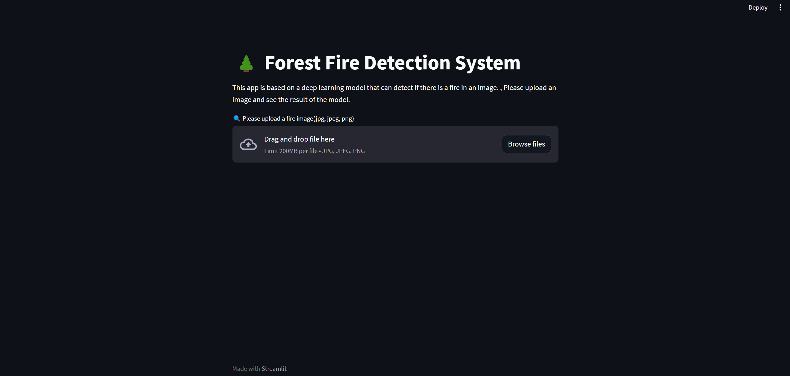
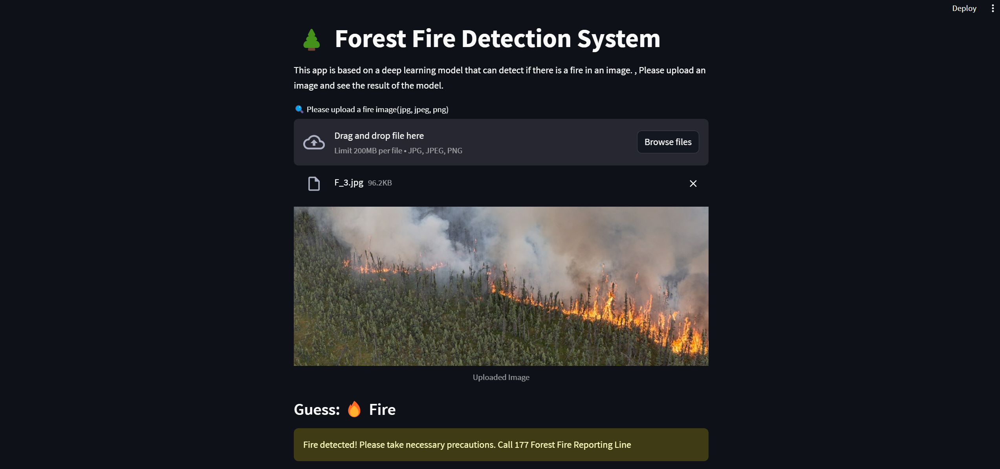

# 🌲 Forest Fire Detection System

This project is a deep learning application designed to detect whether a fire exists in an image. Users can upload a fire image to receive predictions from the model, contributing to early fire detection efforts.

  <!-- Add an image relevant to your project -->

## 🔍 Project Overview

Forest fires are among the most significant environmental disasters, spreading rapidly and causing extensive damage to ecosystems, wildlife, and human life. This project aims to leverage deep learning techniques to detect forest fires efficiently. Using the EfficientNetB0 model with transfer learning, we aim to enhance the model's accuracy while providing a user-friendly interface for ease of use.

### 📈 Goals

- **Early Detection**: To facilitate the quick identification of potential forest fires, aiding in timely response efforts.
- **User Engagement**: To provide a straightforward interface that allows users to interact with advanced machine learning technology without requiring technical expertise.

## 🚀 Features

- **Fast Predictions**: Quickly make predictions based on uploaded images.
- **User-Friendly Interface**: Built with Streamlit for an intuitive and effective user experience.
- **Model Training**: Utilizes the EfficientNetB0 architecture, fine-tuned on specific datasets to improve accuracy.
- **Image Upload**: Users can easily upload images for prediction and view results instantly.
- **Visualization**: Displays the uploaded image and the prediction result clearly.

  <!-- Add an image relevant to your project -->

### Prerequisites

Ensure you have the following installed:

- Python 3.8+
- Required libraries (see `requirements.txt`)
